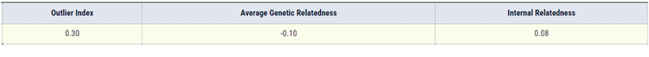

<h3>
<a href="https://ryancaseymba.github.io/LuckyLad/">Back to Lucky Lad Home Page</a>
</h3>
 

### BetterBred Diversity Testing

 
<a href="https://www.betterbred.com/profile/?link=12014" target="_blank">Better Bred Diversity Testing Profile</a>
 
 

## Paw Print Genetics

### Genetic Health Certificate

### Laboratory Disease Report

### Coat Color and Trait Certificate - Page 1

### Coat Color and Trait Certificate - Page 2

