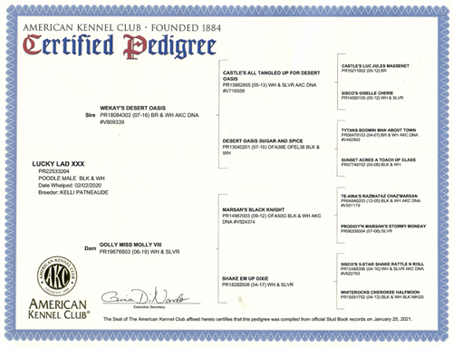

<html>
<head>
<title>Lucky Lad Home Page</title>
<meta name="viewport" content="width=device-width, initial-scale=1.0">
</head>    
<body>

<h3>
<a href="https://ryancaseymba.github.io/LuckyLad/">Back to Lucky Lad Home Page</a>
</h3>
 

## AKC Certified Pedigree

